# Instructions on STAGE II

Instructions on how to prepare your materials in stage II.

> II. Online postdoctoral application (1-3 weeks).
> - Complete **online forms** and prepare **documents** required by SJTU.
> - You need to determine your arriving time and residence time.

These materials required at [the website of SJTU Postdoctoral Management Office](http://postd.sjtu.edu.cn/down/inpost.htm) are shown in *Figure 01*.

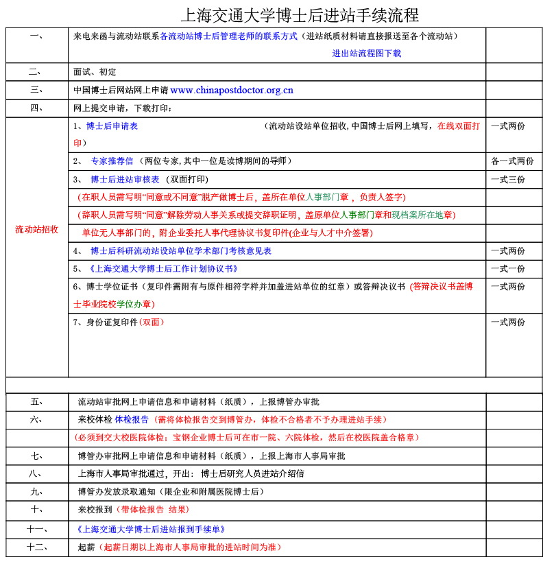

Figure 01

Official procedures for postdoc application in Shanghai Jiao Tong University (SJTU) are shown in *Figure 01*. There are **6 steps** in total that you need to take. This instructions intend to explain the contents and guide you through the most important paperwork, which is **step 3** and **step 4**.

**Step 1**: Learn about discipline classification in SJTU, look for a lab that is your best match.

**Step 2**: Contact the professor in charge. If he/she agrees on your application, then you have 10 more steps to do.

- If declined, you will save yourself from all the following messy paperwork. Either way, congratulations!

**Step 3**: Do the online application; fill in several forms. This is mandatory for all postdoc applications in China.

- Click [HERE](#details-for-step-3-in-stage-ii) for the details.

**Step 4**: After finishing the online application, some documents shall be turned over to SJTU (流动站) for further check.

- Click [HERE](#details-for-step-4-in-stage-ii) for the details.

**Step 5**: Wait for the official approval (博管办) of your application.

- Click [HERE](#details-for-step-5-in-stage-ii) for how to confirm the result.

**Step 6**: Wait for admission notification to sign the contract later in stage III.

## Details for Step 3 in STAGE II

You could find the official website [HERE](http://www.chinapostdoctor.org.cn/WebSite/program/Default.aspx).
Go to the web, click the following icons, and then register an account.

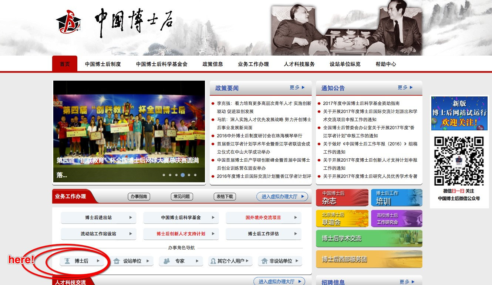

Figure 02

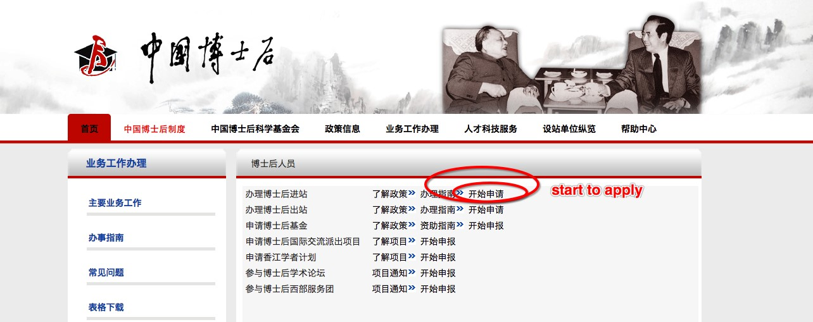

Figure 03

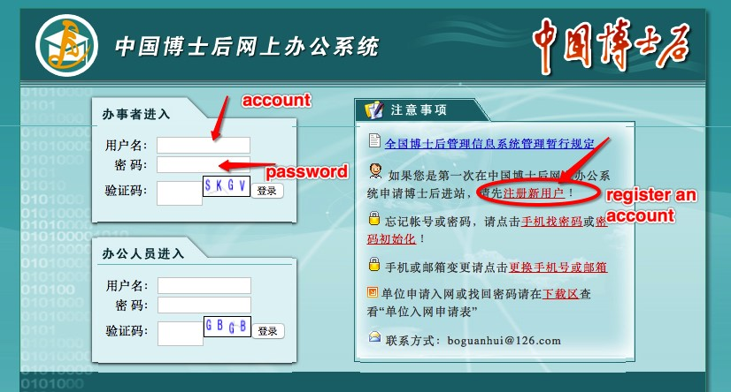

Figure 04

 

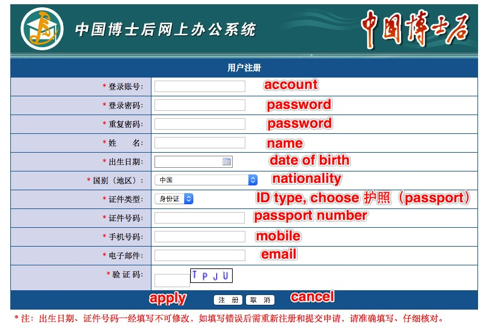

Figure 05

At this point, you have an account, and you will use it to finish the whole online application things. Make sure your registration info are absolutely correct, especially your passport number, you’re not allowed to change it for the second time.

Also, please fill in your **full name** at the ‘name’ column.

Use your account to login the system, click “进出站申请” in the left panel, and begin to input your info.

Upload a photo of yours. Format requirement for the photo is jpg/gif/png/bmp, size less than 300K.

Click the “申请” button on the right as shown in *Figure 06*. A window pops as shown in *Figure 07*, please choose the item as shown in the picture, text for the last line should be “控制理论与控制工程”.

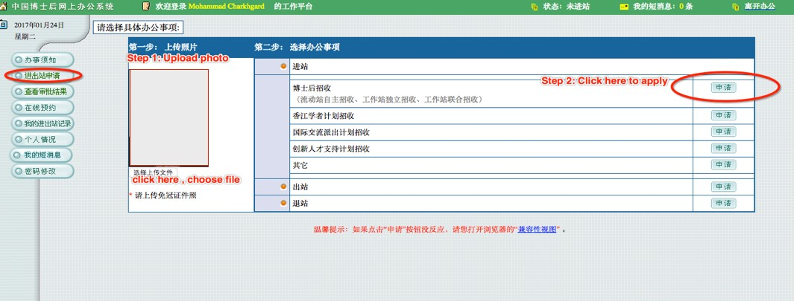

Figure 06

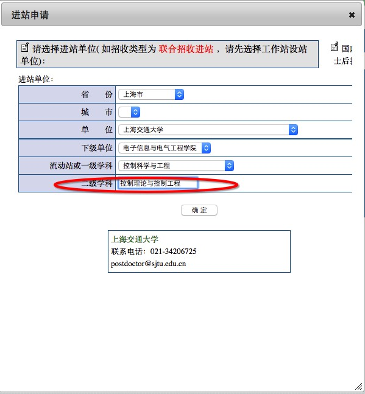

Figure 07

Once you’ve finished the step shown in *Figure 07*, you should be able to see *Figure 08* whenever you login the system. Click “继续填报” to continue.

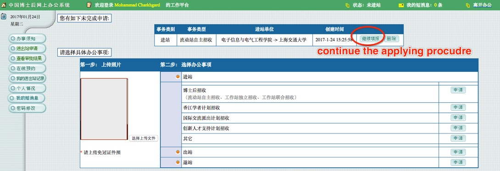

Figure 08

*Figure 09* shows all information you have to complete. We have **numbered** each single instruction, such as “1-1”, ”2-3”, etc. All items will be expanded and explained in the following text.

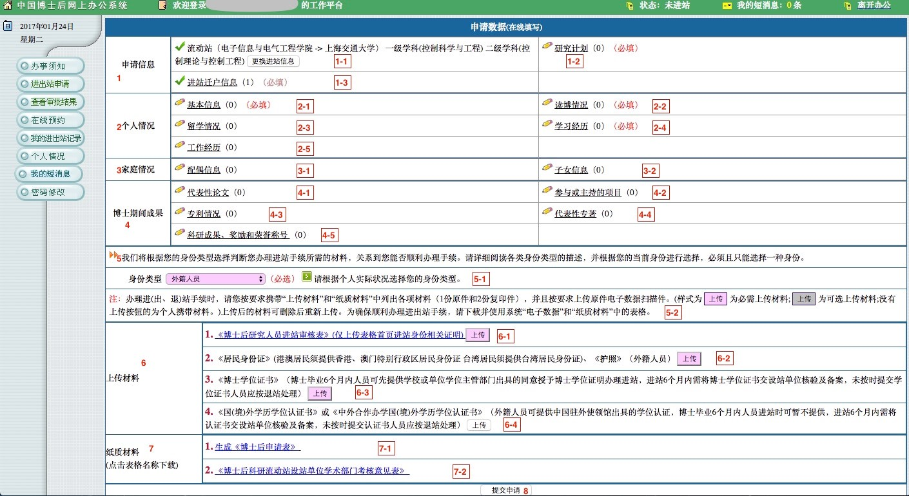

Figure 09

【1-1】: This is written automatically.  
【1-2】: Please see *Figure 10*.  
- Prof.Zhang’s name in Chinese is 张卫东.

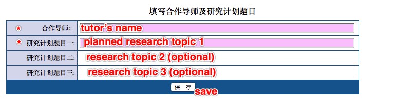

Figure 10

【1-3】: Please see *Figure 11*. For foreign applicants, choose “否”.

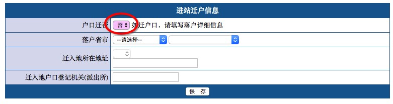

Figure 11

【2-1】: 【Basic personal information】. Please see *Figure 12*.

- In the name column, fill in the **full name**;
- 【gender】: “female”-女; ”male”-男;
- 【marriage】: “married-已婚”; ”unmarried-未婚”; ” divorced-离婚”; ” widowed-丧偶”;
- 【nation】: choose “外籍” (penult);
- 【ID】: choose “护照”.

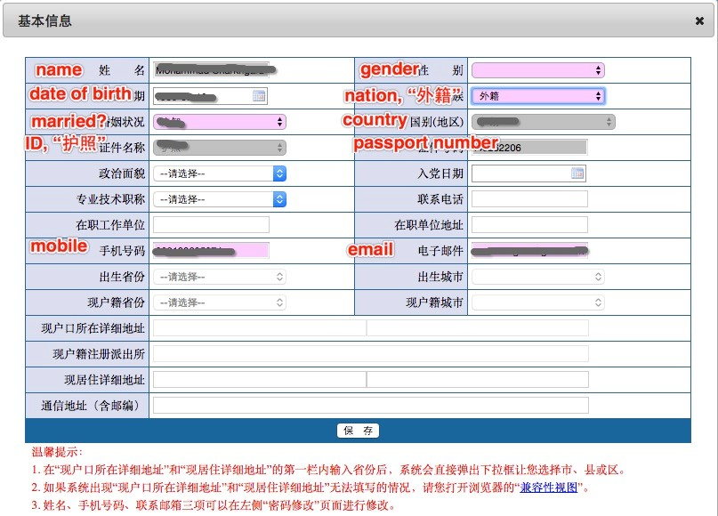

Figure 12

【2-2】: 【Info about your Ph.D. degree】. Please see *Figure 13*.

- ①: 【Ph.D. dissertation title】;
- ②: 【Ph.D. supervisor’s name】 (fill in the full name);
- ③: 【Have your got the Ph.D. diploma?】【Yes-是;No-否】
- ④: 【When is your Ph.D. diploma issued?】
- ⑤: 【When did you successfully defend your thesis?】
- ⑥: 【In which country that you receive your Ph.D. degree?】
- ⑦: 【From which university/affiliation that you receive your Ph.D. degree?】
- ⑧: 【Primary discipline of your doctor’s degree?】 Such as “Control Theory and Techniques”;
- ⑨: 【Secondary discipline of your doctor’s degree?】 Such as “Control Theory and Control Engineering”;
- ⑩: 【Abstract of your Ph.D. dissertation】 (within 1000 words)
- ⑪: 【Awards, honors, achievements during Ph.D. study】 (within 1000 words) 

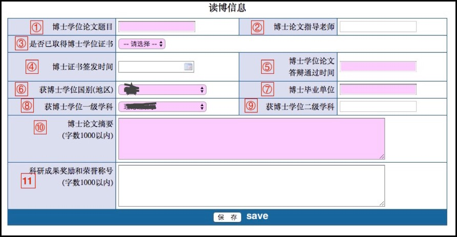

Figure 13

【2-3】: Please see *Figure 14*. For foreign applicant please choose “否”.

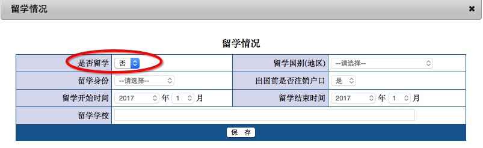

Figure 14

【2-4】: 【Education】. Please see *Figure 15* and *Figure 16*.

- 【degree】: “Bachelor”-本科;“Master”-硕士;“Ph.D.”-博士;“other”-其他.

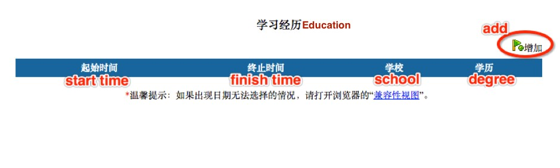

Figure 15

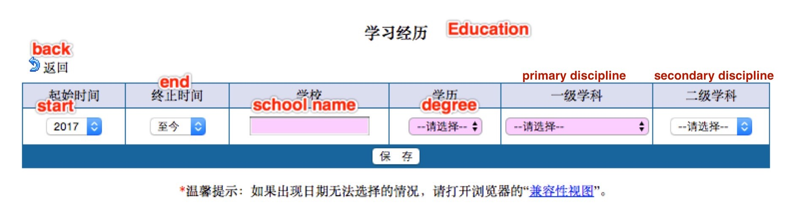

Figure 16

【2-5】: 【Working experience】. Please see *Figure 17* and *Figure 18*.

- 【identity】: “working staff-在职员工”;”visiting scholar-访问学者”;”postdoc-博士后”.

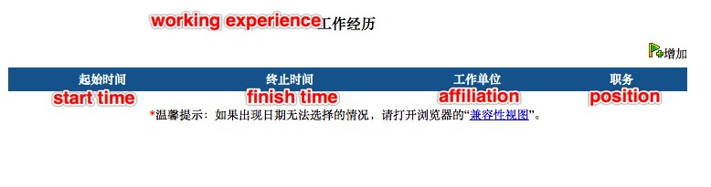

Figure 17

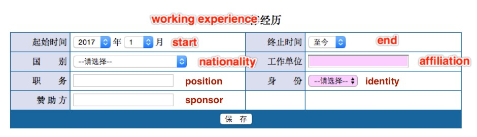

Figure 18

【3-1】: 【Spouse information】. Please see *Figure 19*.

- In the name column, fill in the **full name**;
- 【gender】: “female”-女;”male”-男;
- 【nation】: choose “外籍” (penult);
- 【ID】: choose “护照”;
- 【degree】: “Bachelor”-本科;”Master”-硕士;”Ph.D.”-博士;”other”-其他】
- 【Yes-是;No-否】

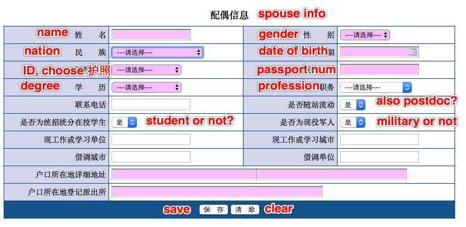

Figure 19

【3-2】: 【Children information】. Please see *Figure 20* and *Figure 21*.

- **We notice that for foreign kids, fill in the passport number will be denied by the system. It seems that the system only accepts the identity number of Chinese citizens right now. So, if you cannot pass the “身份证号” column, which is a must-fill-in item, then we suggest you just leave all the kids info for blank.**
- 【nation】: choose “外籍” (penult);
- 【schooling】: preschool-学前;primary school-小学;middle school-初中;high school-高中;other-其他.

Figure 20

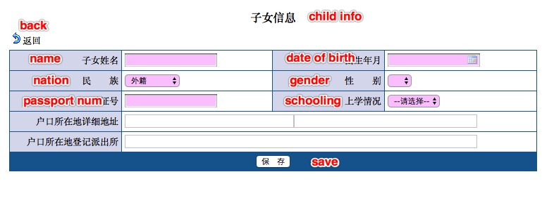

Figure 21

【4-1】: 【Publications】 Please see *Figure 22* and *Figure 23*.

- 【conference type】: domestic academic conference-国内学术会议;international academic conference-国际学术会议;
- 【journal type】: domestic journal-国内刊物;international journal-国际刊物.

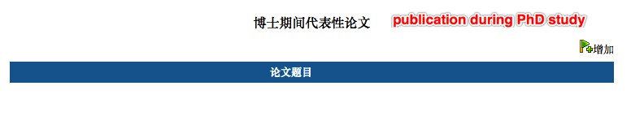

Figure 22

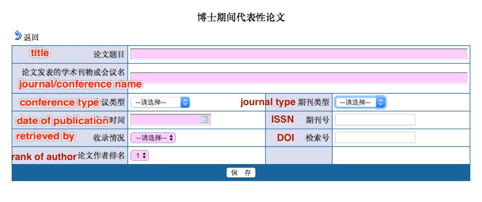

Figure 23

【4-2】: 【Project experience】 Please see *Figure 24* and *Figure 25*.

- 【source】: Project launched by the nation-国家;project within state-省（自治区，直辖市）;military project-军队系统;project from ministry-部委;project launched by your own-单位内部;others-其他;
- 【which kind of project】: Strategic Basic Research-战略性基础研究;Free Exploratory Fundamental Research -自由探索性基础研究;Applied Research Project-应用研究项目;Science and Technology Industrialization Project-科学技术产业化项目;Social public welfare research project-社会公益性研究项目;Scientific and technological conditions of construction and support services-科学技术条件建设与支撑服务项目;others-其他;
- 【progress】: finished-结题验收;mostly done-主要内容已经完成;just launch-项目启动阶段;others-其他.

Figure 24

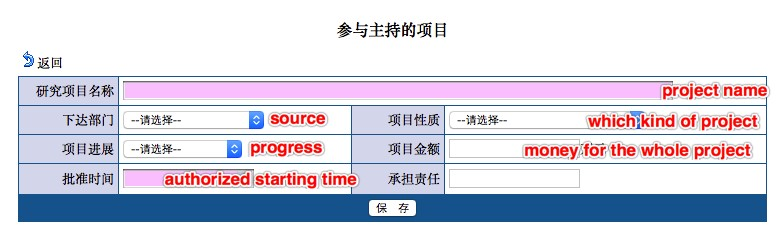

Figure 25

【4-3】:【About patent】 Please see *Figure 26* and *Figure 27*.

- 【type of the patent】: Design patents-外观设计;Utility model patents-实用新型;Invention-发明专利;others-其他.

Figure 26

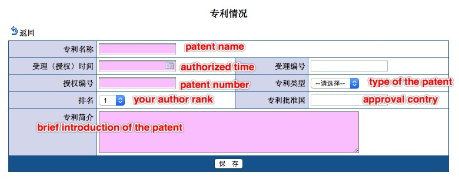

Figure 27

【4-4】:【Published any book?】 Please see *Figure 28* and *Figure 29*.

- 【Yes-是;No-否】
- 【coauthor or not?】: if you write the book on your own, choose “独著”;if there are more than one author, choose “合著”;others-其他;
- 【author rank】: the ranking of your coauthor.

Figure 28

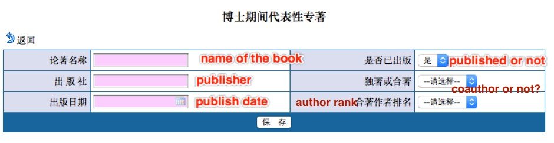

Figure 29

【4-5】:【Honor and awards during PhD study】 Please see *Figure 30* and *Figure 31*.

Figure 30

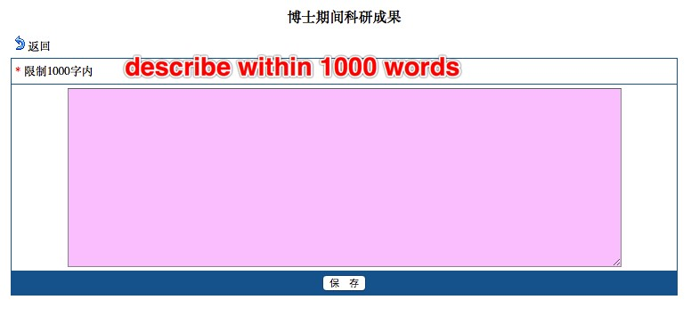

Figure 31

**Now, you are half-way done. It’s time to use that lovely scanner of yours.**

【5-1】: Please choose “外籍人员”.

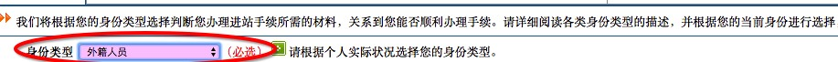

Figure 32

【5-2】: This is to inform you that

- Prepare the documents proposed in【6-1】-【6-4】, scan them and upload them into the system.
- The button in this colour 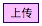 means it is mandatory; and the button in another colour 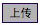 means it is optional.
- Documents in 【7-1】-【7-2】are generated automatically by the system (according to the info you’ve filled in).
- **Please be aware that before you hit the “submit application” button in【8】, you are allowed to withdraw what you’ve uploaded or change whatever the information you’ve filled in. Once you click【8】and submit them, you cannot revise anything**.

【6-1】: Click to download the *.doc* file. It should look like *Figure 33*.

- **You only need to upload the first page of this file.**
- “who’s in charge, sign and seal”: this is about where you save your personnel files. Please find the people in charge of your personnel files, ask him/her to sign and stamp the official seal.

【**About personal profile**】In China, we have personal files/archives that record our information. When a student moves from School A (in China) to School B (also in China), his archive is transferred from A to B. If the student moves from School A (in China) to School C (say, in the U.S.), due to the different system within two countries, apparently his personal archive will not be sent to USA. Also, School A will no longer keep his files. In this case, the student has to find an authorized agency (e.g. a legal Agency D) to store his files. When he comes back from USA and again works in China, say Company E, then, the human resources department of E will take over his personal files from D.

【**For foreign applicants**】 We understand that some countries do not hold such system on personal files. For applicants from those countries, we suggest that you get a sign and a seal from the latest university/company that you worked for. In *Figure 33*, ① is the talent service center, which refers to the agency D mentioned above, ② is the organization you worked for before you come to China. You can choose either ① or ② to get a seal. The seal should come from an authorized organization, and the signature should come from a person that is in charge of it (Don't sign your own name!) . In ②, the text means that your former employer says: this person now has no employment relationship with this organization, but we temporarily preserve his archive for him.

【**Please note that**】 The *.doc* file does not have an English version. The signature and seal can be in English.

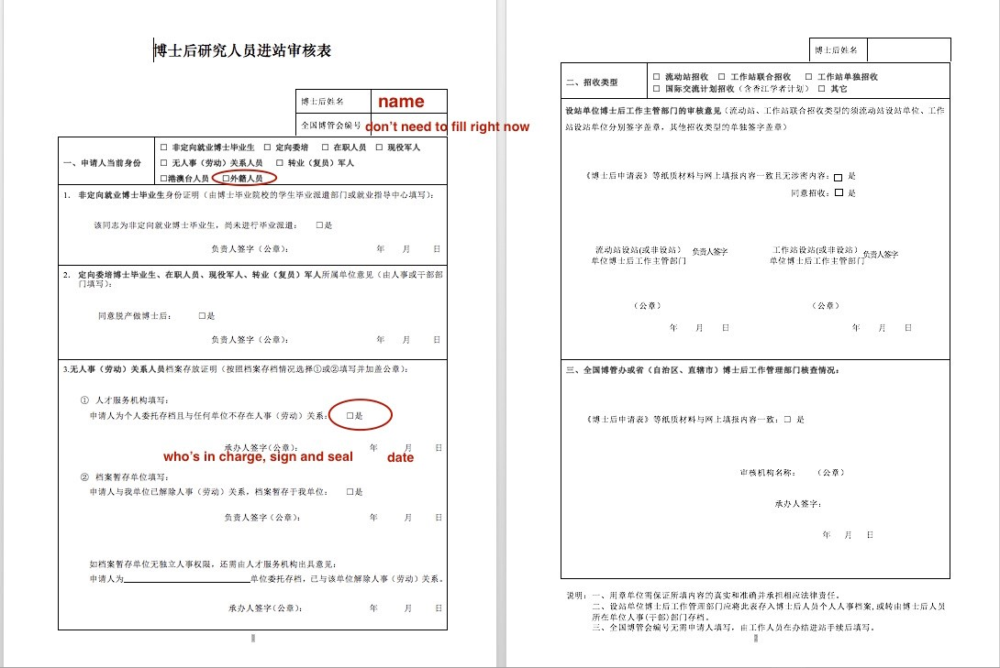

Figure 33

【6-2】: Scan and upload your passport.  
【6-3】: Scan and upload your Certificate of Doctor’s Degree.  
【6-4】: Scan and upload the degree accreditation issued by the Chinese embassy in your country.  
【7-1】: Download the file.  
【7-2】: Download the file.  
【8】: **Click to submit the application.**  

## Details for Step 4 in STAGE II

You could find the official website [HERE](http://postd.sjtu.edu.cn/down/inpost.htm)

As you can see, you should hand over 8 documents in total. For foreign applicants who have not had a trusted friend in China, students from IPAC can help you. You have to prepare the documents in person, and send us through emails.

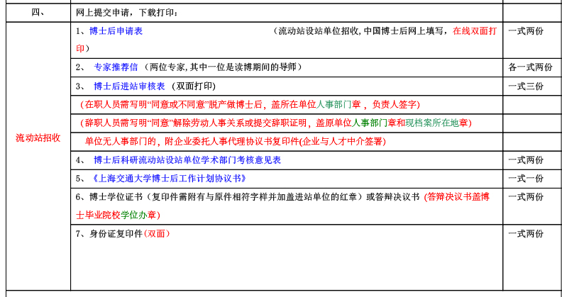

Figure 34

1. 博士后申请表. This is the document generated automatically by the system, please see【7-1】in Step 3.

2. 专家推荐信. This is recommendation letter. You are required to handover **2 recommendation letters** from experts in your research field. One of the experts should be **your Ph.D. supervisor**.

3. 博士后进站审核表. This is the document from【6-1】in Step 3. Here it **requires both 2 pages**. The second page should be filled by SJTU, so don’t worry about it.

4. 博士后科研流动站设站单位学术部门考核意见表. Filled by professors in SJTU.

5. 上海交通大学博士后工作计划协议书. You should fill the following page (*Figure 35*) within [the document](http://postd.sjtu.edu.cn/t/t1/gzjh-new.doc).

6. 博士学位证书. Scan your Certificate of Doctor’s Degree , the same as in【6-3】, Step 3.

7. 身份证复印件. This is the copy of your ID card. For foreign applicants, please scan your passport, the same as in【6-2】, Step 3.

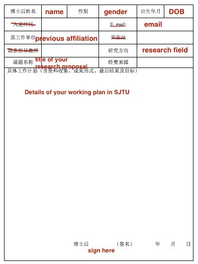

Figure 35

## Details for Step 5 in STAGE II

You should be able to see the result [HERE](http://www.chinapostdoctor.org.cn/WebSite/program/Default.aspx).
After login in the system, choose “查看审批结果” on the left panel.

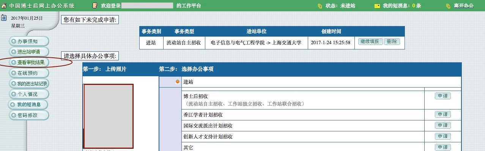

Figure 36

***

Back to [the Guide](README.md).