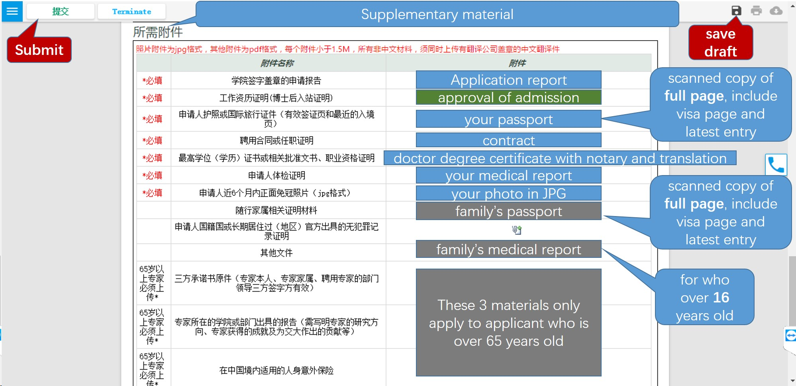

# Instructions on STAGE IV

> IV. Visa and Residence Permit Application.
> - Z visa would take 3 weeks to issue, which permits your entry to China.
> - Residence permit should be applied after your arrival.

Major steps:

1. [Apply for Visa](#apply-for-visa)
2. [Schedule Departure and Medical Examination](#schedule-departure-and-medical-examination)
3. [Arrive and Register with the Local Police](#arrive-and-register-with-the-local-police)
4. [Register with SJTU](#register-with-sjtu)
5. [Apply for Work Permit](#apply-for-work-permit)
6. [Apply for Residence Permit](#apply-for-residence-permit)

## Apply for Visa

Please submit the following documents by e-mail to us with documents attached. While submitting documents, please figure out which country where you would be and proceed your visa. You may select one Chinese Embassy/Consulate from available options that would be given later.

### Documents List

**Note**: all documents except passport should be **translated** from non-Chinese into Chinese by qualified translation agency, since scanned copies in BOTH versions are required.

1. **Information page in passport**;

2. **Photograph**;
    - Bareheaded;
    - Recently taken in 6 months;
    - In white background;
    - No margin;
    - No less than 354 * 472 resolution.

3. **Health report**;
    - Issued by the health and medical institution in recent 6 months;
    - NOTE: the health and medical institution should be recognized by the Chinese Embassy/Consulate.
    - **If there is not enough time, please contact us to sign a commitment letter for a later physical examination**.

4. **PhD degree certificate**;
    - Certified by the Chinese embassy/consulate.

5. **Certificate of work experience**;
    - With seal or signature of your former employer on;
    - Including position, working hours, project you have ever done and contact information of witness.
    - **If your employer may provide the certificate late, please let us know**.

6. **Documents of family member(s)**.
    - **Only if** he/she is about to accompany you during post-doc program;
    - **Photograph**, **health report** (for who over 18) and **passport** as requested above;
    - Proof of your relationship (For instance, marriage certificate for your wife; birth certificate for your child).

**Tips**: we recommend that you submit documents 1. and 2. of you and your family member(s) first, since it might take time to certify and translate other documents.

### Proceed Z Visa

It would take about 2 weeks to issue NOTIFICATION LETTER OF FOREIGNER’S WORK PERMIT IN THE PEOPLE’S REPUBLIC OF CHINA, which you would receive by e-mail in soft copy. Kindly note that no hard copy would be dispatched.

Please print the **notification letter** and take it to the Chinese Embassy/Consulate, as you select before, to proceed Z visa for yourself, and S1 or S2 visa for your family (which visa for your family depends on whether he/she would accompany you for over 180 days in China). Visa issue would take 5 days or so.

## Schedule Departure and Medical Examination

Book air tickets to China by your own. Please negotiate with Prof. Zhang on your schedule before booking tickets.

You are supposed to make an appointment for medical examination later for yourself (and your family over 16 years old). Click [here](http://www.sithc.com/sithcen/introducionofservice/healthadministration/healthadminitration/201311/t20131122_15145.html) for details.

## Arrive and Register with the Local Police

Required to apply for residence permit within 30 days from the date of entry. If you would NOT stay in a hotel, then after your arrival in China **within 24 hours**, please remind the one who would provide you with accommodation of reporting to the police station - near where you are accommodated - for temporary residence permit.

Take a **medical examination ASAP** in SITHC (Shanghai International Travel Healthcare Center) as you have made an appointment. When you finish medical exam, an address is required to dispatch medical report. Here is the address of IPAC: **Room 205, SEIEE Building 2, SJTU, Dongchuan Road 800 (闵行区东川路800号，上海交通大学电信群楼2-205)**.

## Register with SJTU

When you first come to SJTU, please register in the postdoc office at the following address: Room 421, New Administration Building B (新行政楼B 421室). New Administration Building is the building with a bell tower on campus. At last you would receive a table (like *Figure 37*) that guides you on subsequent procedures.

Figure 37

While registering, please give the table to staff to proceed; and take back at the end of each step. After you finish all the steps, please submit the table and photocopies of your bank card (issued in step 7 below) and passport to the postdoc office.

Here are steps on the table (steps 2, 3 and 6 do not apply to foreigners)

### Step 1. Register with Postdoc Office

Once you get the table, this step has been done.

### Step 4. Apply for Campus Card and jAccount

Apply for a campus card and open your jAccount at Network and Information Center (next to the library). Campus card is your ID of SJTU membership, and also functions as prepaid card for dinners in canteens. You may need to save some money into campus card before you pay. jAccount is your virtual ID of SJTU, which would be used to apply for **work permit** later.

If your full name is too long to print on campus card, please tell the staff there how to shorten your name. You need to set a 6-digit password for your campus card, which would be asked to input when you are about to pay over a certain amount.

Once the username of your jAccount has been set, it could not be changed after. The password of your jAccount could be a combination of letters and numbers.

### *Step 5. Join union for SEIEE (optional)*

Whether to join union is up to you. Member pay fees monthly for welfare from union. For details, please refer to the postdoctor office.

### Step 7. Apply for a bank card for business use (related to salary)

Apply for a bank card in the hall of Financial Office, on the 1st floor of New Administration Building B.

**Since long term residence permit is required in this step, you may proceed steps 8 and 9 first**.

### Steps 8 & 9. Register in the office of dept. of automation

Take the table to Room 417, SEIEE building 2; then turn to Youren Chen (陈友仁). He would arrange your office.

## Apply for Work Permit

Work permit should be applied online, which is required for later residence permit application.

### Prerequisite

1. Z visa and temporary residence permit for you (and your family).

2. Application report, which would be sent to you.
    - The report would be **in Chinese**, and submitted by SJTU on your behalf to Shanghai Administration of Foreign Experts Affairs.

3. jAccount, which you have opened while registering in step 4.

4. Medical report, which would be dispatched in 5 days after medical exam.

5. Contract, which have been signed on stage III.

### Put in a request

Log in with your jAccount [HERE](http://my.sjtu.edu.cn). Click 【流程】 (Progress) as shown in *Figure 38*.

Figure 38

Under the tab 【服务大厅】 (Service Center), Choose 【国际交流】 (International exchange) as shown in *Figure 39*.

Figure 39

Click 【来华签证申请】 (Visa application in China) as shown in *Figure 40*.

Figure 40

Choose 【申请《外国人工作许可证》或《外国人工作许可通知》】 (Apply for WORK PERMIT or NOTIFICATION LETTER) and 【《外国人工作许可证》申请（已办理外国人工作许可通知）】 (WORK PERMIT application with NOTIFICATION LETTER issued)as shown in *Figure 41*, then click 【开始办理】 (proceed).

Figure 41

Input your passport number in the pop-up as shown in *Figure 42*. Then click 【检查】 (Check) to check whether your name matches. Click 【继续办理】 (Continue) if everything is correct.

Figure 42

You would fill Work Permit Application Form as shown in *Figure 43*. Only items with a red star (*) beside are compulsory.

Note important information **in red**. You could fill part of the form, and **save draft** to complete later.

Figure 43

### Review your request

Once you have saved draft, you can reopen the form and continue to fill. On the homepage after logging in [HERE](http://my.sjtu.edu.cn), Click "Task" with a red 1 beside like *Figure 44*.

Figure 44

Under the tab 【待办事项】 (To-do list), find the request you have put in and click as *Figure 45*.

Figure 45

### Complete the form and submit

Other information needed in 【基本信息】 (Basic Information) is shown in *Figure 46*.

Figure 46

【来华信息】 (Information About Your Visit) is shown in *Figure 47*. Kindly note that those info **in green** would be specified below.

Figure 47

Please copy the following text to the input, **except for 【在华紧急联系人电话】**:

- 【校内聘用单位名称】：电子信息与电气工程学院；
- 【电话】：021-34204019；
- 【校内聘用单位地址】：上海交通大学电信群楼；
- 【邮政号码】：200240；
- 【在华拟聘职务】：博士后；
- 【在中国工作任务】：科研；
- 【在华紧急联系人姓名】：张卫东；
- *【在华紧急联系人电话】：would be given in other ways*；
- 【在华紧急联系人邮件】：wdzhang@sjtu.edu.cn；
- 【在华住址】：上海市闵行区东川路800号上海交通大学电信群楼2-403；
- 【电话】：021-34204019；
- 【外国人来华工作分类标准】：高端人才A类；
- 【外国人来华工作分类标准（详细）】：优秀青年人才。

【来华相关信息】(Other info about your visit) is not compulsory.

【教育信息】(Higher education) should be input **in Chinese**. You may turn to someone for help with translation. Please note that there should be **no gap** in combination of 【教育信息】(Higher education) and 【工作信息】(Work experience); otherwise add 【自由职业】 (means freelancer) in Work experience.

Click 【新增】 (Add) as shown in *Figure 48* to add a new line. Input 【就读时间】 (attend date), 【就读院校】 (university), 【就读专业】 (department), 【教育类型】 (【全日制】for full-time; or 【非全日制】 for part-time), 【学位】 (degree), 【所在国家】(country where your university is).

Figure 48

【工作信息】(Work experience) except 【单位地址】(address), should be input **in Chinese**. You may turn to someone for help with translation. Please input all work experience **since higher education**. If your work experience lasts for more than 10 years, only input work experience in recent 10 years.

Click 【新增】 (Add) to add a new line. Input 【聘用时间】 (employment date), 【工作单位】 (employer), 【工作岗位】 (which post, such as management post or technical post), 【单位地址】 (address), 【担任职务】 (rank of position), 【工作任务】 (work tasks), 【所在国家】 (country), as shown in *Figure 49*.

Figure 49

【随行家属】(Family accompany info) **CANNOT be changed afterwards once submitted**. Input info as shown in *Figure 50*.

Figure 50

While inputting 【教育信息】(Higher education), 【工作信息】(Work experience), or 【随行家属】(Family accompany info), if you add a blank line by accident, place the mouse pointer over right margin as shown in *Figure 51*. Then 2 options would appear; just click 【删除】 (delete), and select 【是】 (yes) in a pop-up to remove the line.

*Tips: the way how to add file slots to upload in 【所需附件】(Supplementary material) is similar.*

Figure 51

【所需附件】(Supplementary material) is shown in *Figure 52*, which need upload related documents. Click button  to upload file. Note that only those with 【*必填】in red are compulsory, and the others are either optional or conditional. Those info **in grey** depends (on whether your family would accompany you in China, and whether you are over 65 years old).

**Translation of your doctor degree certificate should be verified by SEIEE. Please take translation of your doctor degree certificate to Room 317, Bldg 3 of SEIEE 【电院群楼3号楼317室】; turn to 杜北辰 (Beichen Du) for stamp.**

Figure 52

"**approval of admission**" is a document you would receive, which approves your admission to SJTU.

After you make everything clear, click 【提交】 (submit) and confirm your submission. In the next few days, please check the status of your request as you do in the part *Review Your Request*. You would also receive a notice by email, call, or phone message about your request.

Once your application is approved, you would receive an email with your application form attached. Check whether everything is correct (e.g. names would have been identical to what passport shows). 

Afterwards print the application form,; put a tick by the paragraph of your promise; sign your name and date. Take it to Room 317, Bldg 3 of SEIEE 【电院群楼3号楼317室】; turn to 杜北辰 (Beichen Du) for stamp. Finally submit the form to visa office at Room 200, New Administration Building B 【新行政楼B200室】.

## Apply for Residence Permit

It would take about 2 weeks to issue work permit. The documents for residence permit application might differ, depending on whether your work permit would be issued within 30 days from the date of entry.

If your work permit would be still in process after 30-days limit, please timely turn to visa office for a letter, which would state your current situation. Then take the following documents to Minhang Visa center, Shanghai Exit-Entry Administration Bureau 【上海市出入境管理局 闵行受理点】 at Shenbei Road No.3 【申北路3号】.

1. Letter issued by SJTU;

2. Temporary residence permit issued by Police;

3. Health report;

4. Passport size photograph;

5. Original Passport;

6. *Work permit if issued.*

At the Center you would fill in application form for requesting residence permit. After documents would be verified and collected, you would receive a receipt of submission (collection) of passport for residence permit. Once the residence permit is issued, it would be dispatched to SJTU.

***

Back to [the Guide](README.md).
